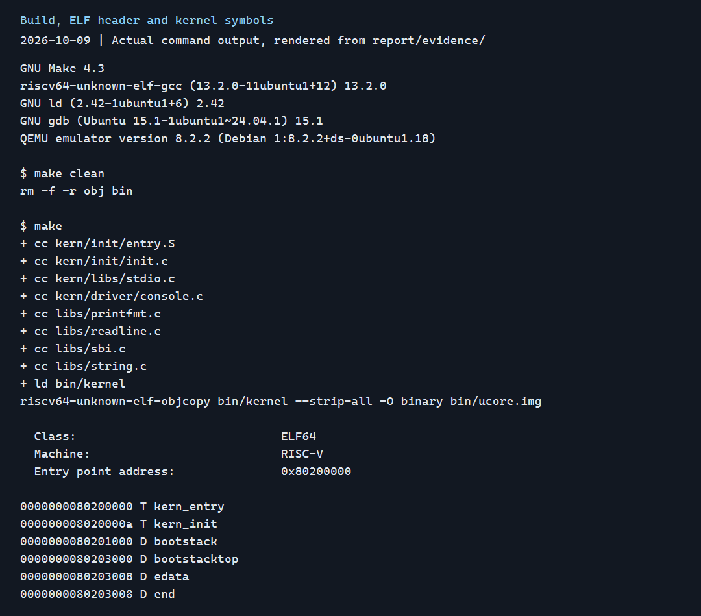
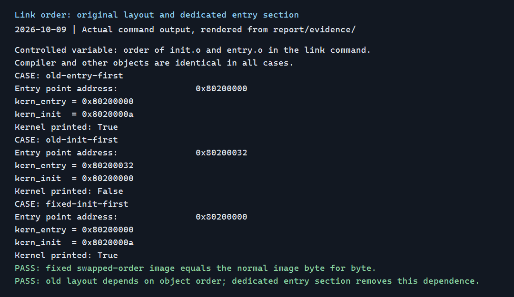
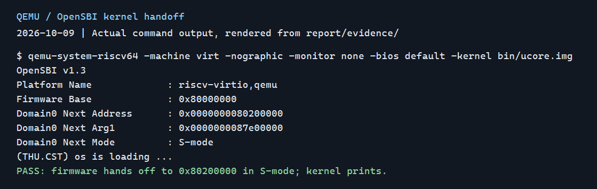
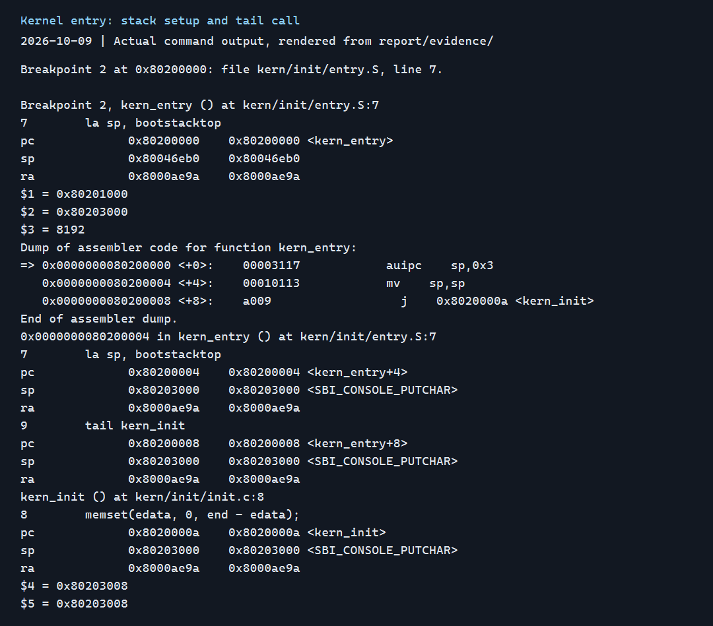
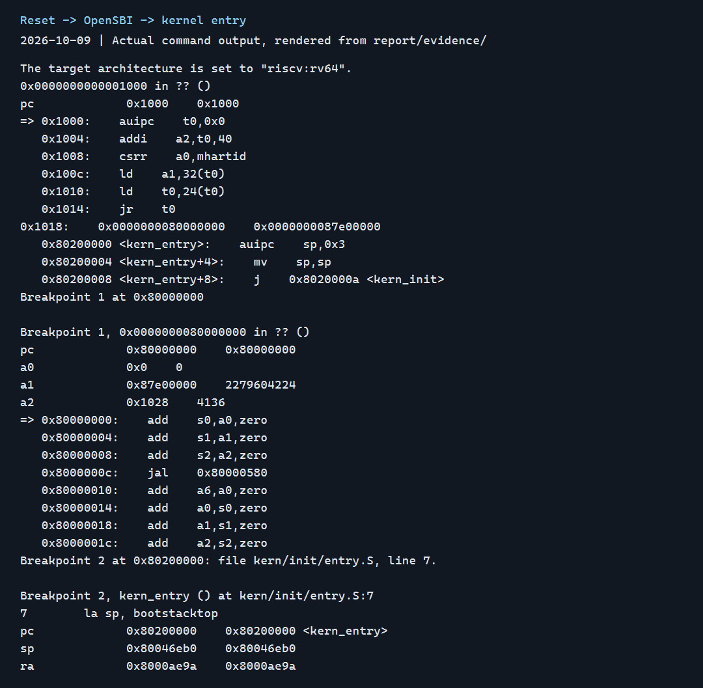
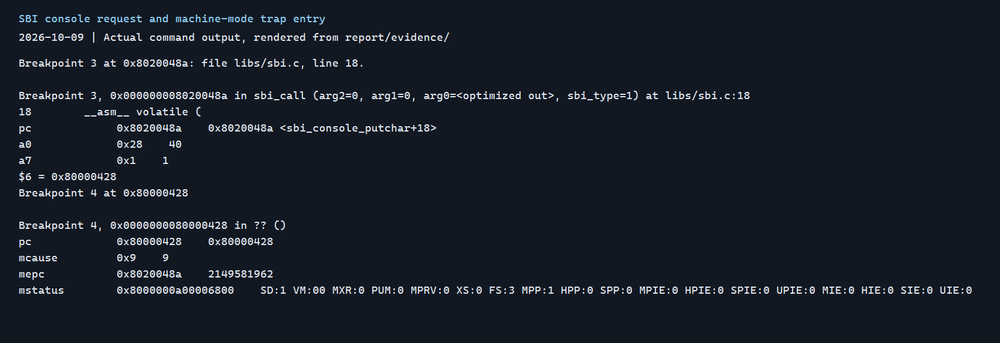

# Lab 1：最小可执行内核与 RISC-V 启动流程

邹瑛琦（2412744）、丁子昂（2411130）

仓库：[os-2026-labs，lab1 分支](https://github.com/felixzyqwx-design/os-2026-labs/tree/lab1)

## 1. 从源文件到内核第一条指令

本实验由两位组员共同协作完成，包括环境配置、启动调试、兼容性修正和结果整理。

Lab 1 要解决的问题是：一份 C 和汇编写成的内核，怎样成为内存中的机器指令，又怎样获得 CPU 的控制权？我们先检查构建和链接布局，再用 QEMU 运行镜像，最后用 GDB 观察启动过程及入口指令。

```text
entry.S、init.c 和基础库
  → 交叉编译得到 RISC-V 目标文件
  → kernel.ld 链接成 ELF：bin/kernel
  → objcopy 提取裸镜像：bin/ucore.img
  → QEMU 预装固件和镜像，启动虚拟 CPU
  → 0x1000 的复位代码
  → 0x80000000 的 OpenSBI
  → 0x80200000 的 kern_entry
  → 设置内核栈，进入 kern_init
  → 初始化零数据区，输出启动信息，保持运行
```

前半段决定代码和数据放在哪里，后半段决定 CPU 按什么顺序执行。两者要对接成功，固件的下一跳地址、内核链接地址和镜像开头的指令必须一致。

本报告采用 2026 年 10 月 9 日在 WSL2/Ubuntu 24.04.1 LTS 上的复测结果。工具版本为 Make 4.3、RISC-V GCC 13.2.0、GNU ld 2.42、GDB 15.1 和 QEMU 8.2.2，QEMU 内置 OpenSBI 1.3。兼容性检查还使用了 Windows 环境中的 SiFive GCC 10.2.0、GDB 10.1 和 QEMU 5.1.0。

## 2. 构建、链接与镜像布局

### 2.1 核心文件

| 文件 | 作用 |
| --- | --- |
| `code/Makefile` | 编译、链接、生成裸镜像，启动 QEMU 和 GDB |
| `code/tools/kernel.ld` | 设置基址、入口符号和各输入节的放置顺序 |
| `code/kern/init/entry.S` | 预留内核栈，设置 `sp`，跳到 C 入口 |
| `code/kern/init/init.c` | 初始化零数据区，调用 `cprintf`，进入循环 |
| `code/kern/libs/stdio.c`、`code/libs/printfmt.c` | 处理可变参数和格式字符串，将结果逐字符输出 |
| `code/kern/driver/console.c`、`code/libs/sbi.c` | 将字符输出交给 OpenSBI |

在仓库的 `code/` 目录执行：

```bash
make clean
make
riscv64-unknown-elf-readelf -h bin/kernel
riscv64-unknown-elf-nm -n bin/kernel
```

构建成功生成 `bin/kernel` 和 `bin/ucore.img`。主要结果如下：

```text
Class:               ELF64
Machine:             RISC-V
Entry point address: 0x80200000

0x80200000  kern_entry
0x8020000a  kern_init
0x80201000  bootstack
0x80203000  bootstacktop
0x80203008  edata
0x80203008  end
```



### 2.2 ELF 与裸镜像

`kernel.ld` 中的 `OUTPUT_ARCH(riscv)` 指定目标架构，`ENTRY(kern_entry)` 设置 ELF 入口，`. = BASE_ADDRESS` 从 `0x80200000` 开始安排内容。当前节布局为：

| 输出节 | 起始地址 | 大小 | 内容 |
| --- | --- | --- | --- |
| `.text` | `0x80200000` | `0x4c0` | 入口和函数指令 |
| `.rodata` | `0x802004c0` | `0x270` | 字符串、只读常量等 |
| `.data` | `0x80201000` | `0x2000` | 静态内核栈 |
| `.sdata` | `0x80203000` | `0x8` | 此次链接保留的 SBI 服务号数据 |

`. = ALIGN(0x1000)` 将数据区起点上调到 4096 字节的整数倍。汇编中的 `.align PGSHIFT` 也按 `2^12` 对齐。栈占两页，大小为 8192 字节。

ELF 保留入口、符号、调试信息和程序头。链接主要依据节（section）组织内容；ELF 加载器依据程序头描述的可加载段（segment）映射内存。本次 ELF 的两个 `LOAD` 段分别包含 `.text/.rodata` 和 `.data/.sdata`。

`objcopy --strip-all -O binary` 提取可装载内容，生成按地址展开的裸镜像。裸镜像没有 ELF 入口字段，装载地址和起始执行地址由启动配置约定。`.bss` 通常是 `NOBITS`，其零初始化空间也不能简单等同于镜像中同样多的零字节。

### 2.3 入口布局问题与修正

旧代码把 `kern_entry` 放在通用 `.text` 节中，链接脚本又用一条通配规则收集多个代码节。入口是否位于镜像开头，会受到目标文件顺序影响。跨环境检查中出现了 `kern_init=0x80200000`、`kern_entry=0x80200032` 的布局，QEMU 只输出了 OpenSBI 信息。

修正后的入口使用专用输入节：

```asm
.section .text.kern_entry,"ax",%progbits
.globl kern_entry
```

链接脚本先收集该节，再收集其余代码：

```ld
.text : {
    KEEP(*(.text.kern_entry))
    *(.text .stub .text.* .gnu.linkonce.t.*)
}
```

顺序保证入口在最前面；`KEEP` 显式保留入口节，使其免受 `--gc-sections` 回收。`ENTRY` 负责记录执行入口，节布局负责安排入口的实际位置，两者作用不同。

我们在同一套 WSL 工具链上交换 `entry.o` 与 `init.o` 的顺序，得到：

| 布局与链接顺序 | ELF 入口 / `kern_entry` | `kern_init` | 内核输出 |
| --- | --- | --- | --- |
| 旧布局，`entry.o` 在前 | `0x80200000` | `0x8020000a` | 有 |
| 旧布局，`init.o` 在前 | `0x80200032` | `0x80200000` | 无 |
| 修正后，`init.o` 在前 | `0x80200000` | `0x8020000a` | 有 |

第三组的裸镜像与正常顺序的镜像逐字节相同。这个对照实验把问题定位到链接顺序依赖，也验证了入口布局修正的作用。



### 2.4 `kern_init` 的初始化

```c
extern char edata[], end[];
memset(edata, 0, end - edata);
```

`edata` 和 `end` 是链接器定义的边界符号。代码用这段范围准备 C 所要求的零初始化数据区。本次两者都为 `0x80203008`，因此清零长度为 0；加入被程序使用并保留的未初始化全局变量后，这段范围会包含对应的数据。

输出启动字符串后，`kern_init` 执行 `while (1)`。最小内核还没有调度器，也没有可返回的上层调用者，循环让它留在内核运行状态。

## 3. QEMU 运行结果

在 `code/` 下执行 `make qemu`，当前目标使用：

```bash
qemu-system-riscv64 -machine virt -nographic -bios default -kernel bin/ucore.img
```

关键输出为：

```text
OpenSBI v1.3
Firmware Base        : 0x80000000
Domain0 Next Address : 0x0000000080200000
Domain0 Next Mode    : S-mode
(THU.CST) os is loading ...
```



最初使用指导书旧示例的 `-device loader,file=...,addr=0x80200000` 时，本机 OpenSBI 的下一跳地址为 0。改用 `-kernel` 后，QEMU 在预装镜像的同时向固件提供了下一阶段入口。该适配与上一节的入口布局修正共同保证了内核启动。

测试脚本在看到输出后结束 QEMU。交互展示时，可按 `Ctrl+A`，松开后再按 `X` 退出。

## 4. 练习 1：内核入口的两条伪指令

入口源码为：

```asm
kern_entry:
    la sp, bootstacktop
    tail kern_init
```

### 4.1 `la sp, bootstacktop`

`la` 将静态栈顶的地址装入 `sp`。栈向低地址增长，空栈指向栈区上界；C 函数进入后会减小 `sp`，在栈中保存返回地址、寄存器和局部数据。汇编中的 `.space KSTACKSIZE` 已经预留了这块空间。

实测 `bootstack=0x80201000`、`bootstacktop=0x80203000`，地址差为 `0x2000`，即 8192 字节。

### 4.2 `tail kern_init`

`tail` 将控制权交给 `kern_init`，不写入新的 `ra` 返回地址。`kern_init` 声明了 `noreturn`，并在最后进入循环，入口汇编也没有后续工作需要它返回后继续执行。

### 4.3 单步结果

终端 A 运行 `make debug`，终端 B 运行 `make gdb`。GDB 中执行：

```gdb
set pagination off
break *kern_entry
continue
info registers pc sp ra
disassemble /r kern_entry
p/d (unsigned long)&bootstacktop - (unsigned long)&bootstack
si
info registers pc sp ra
si
info registers pc sp ra
si
info registers pc sp ra
```

本机反汇编为：

```text
0x80200000: 00003117  auipc sp,0x3
0x80200004: 00010113  mv    sp,sp
0x80200008: a009      j     0x8020000a <kern_init>
```

| 停止位置 | `pc` | `sp` | `ra` |
| --- | --- | --- | --- |
| 入口第一条指令前 | `0x80200000` | `0x80046eb0` | `0x8000ae9a` |
| 执行 `auipc` 后 | `0x80200004` | `0x80203000` | `0x8000ae9a` |
| 完成 `la` 后 | `0x80200008` | `0x80203000` | `0x8000ae9a` |
| 执行 `tail` 后 | `0x8020000a` | `0x80203000` | `0x8000ae9a` |

`auipc` 按当前 PC 加上 `0x3000` 得到栈顶。第二条是 `addi sp,sp,0` 的别名显示，低位偏移恰好为 0。最后的 `j` 是不写 `ra` 的压缩跳转，长度为 2 字节，所以 C 入口位于 `0x8020000a`。其他工具链的伪指令展开可能不同，观察时应以该次反汇编为准。

GDB 将 `sp` 的地址显示为 `<SBI_CONSOLE_PUTCHAR>`，是因为该数据符号恰好与 `bootstacktop` 同址。栈从这个地址向下增长，SBI 数据从这里向上占用空间，两者没有重叠。



## 5. 练习 2：从复位到内核第一条指令

重新启动停在复位状态的 QEMU。初始连接后读取 PC，在两个后续入口设置断点：

```gdb
info registers pc
x/6i 0x1000
x/2gx 0x1018
x/3i 0x80200000
break *0x80000000
continue
info registers pc a0 a1 a2
x/8i 0x80000000
break *kern_entry
continue
info registers pc sp ra
```

### 5.1 最初执行的指令在哪里，做什么？

本机 QEMU `virt` 的复位 PC 为 `0x1000`，该处是 MROM 复位跳转代码。最初六条指令为：

```text
0x1000: auipc t0,0x0
0x1004: addi  a2,t0,40
0x1008: csrr  a0,mhartid
0x100c: ld    a1,32(t0)
0x1010: ld    t0,24(t0)
0x1014: jr    t0
```

它们先取得复位代码附近的基址，再准备启动参数：`a0` 为 hart ID，`a1` 为设备树地址，`a2` 指向固件使用的动态启动信息；最后读取下一跳地址并跳转。

读取 `0x1018` 附近的数据得到 `0x80000000` 和 `0x87e00000`，分别对应固件入口和本次设备树地址。执行 `jr t0` 后 PC 转向固件，后面的入口地址数据不再是顺序执行的指令。

### 5.2 两个后续断点

第一个断点命中 `0x80000000`。此时 `a0=0`、`a1=0x87e00000`、`a2=0x1028`，OpenSBI 入口先保存这些启动参数，随后进入初始化代码。

第二个断点命中 `0x80200000` 的 `kern_entry`。OpenSBI 的输出同时给出 `Next Mode: S-mode`，内核开始在 S 模式执行，接着完成练习 1 中的栈初始化。

在初始 PC 仍为 `0x1000` 时，GDB 已能读取 `0x80200000` 的内核指令。这说明本次内核由 QEMU 在 CPU 开始执行前预装到内存。这里适合用入口断点观察控制权移交；对 `0x80200000` 设置写观察点，通常不会捕捉到一次由客户 CPU 执行的镜像加载。

### 5.3 启动链

```text
0x1000      MROM：准备参数、读取下一跳地址
    ↓
0x80000000  OpenSBI：机器级初始化，向 S 模式移交控制权
    ↓
0x80200000  kern_entry：设置内核栈
    ↓
0x8020000a  kern_init：初始化数据区，输出启动字符串，循环
```

`0x1000` 是这款 QEMU 机器的复位地址；`0x80000000` 和 `0x80200000` 分别是本实验的固件与内核布局约定。RISC-V 指令集并没有要求所有硬件都使用这三个地址。



## 6. 从 `cprintf` 到 SBI

内核通过项目自己的 `stdio.h` 和输出函数打印字符串。源码调用链为：

```text
cprintf → vcprintf → vprintfmt → cputch → cons_putc
        → sbi_console_putchar → sbi_call → ecall → OpenSBI
```

`cprintf` 收集可变参数，`vprintfmt` 解析 `%s` 等格式项，回调将结果逐字符交给控制台。这份代码使用 legacy SBI 控制台接口：服务号 1 放入 `a7/x17`，字符放入 `a0/x10`，随后执行 `ecall`。

2026 年 10 月 9 日的复测中，第一处输出 `ecall` 位于 `0x8020048a`。执行前 `a7=1`、`a0=0x28`，后者是字符 `(`。读取 `mtvec` 后在其入口设置断点，继续执行得到：

```text
mtvec  = 0x80000428
pc     = 0x80000428
mcause = 9
mepc   = 0x8020048a
MPP    = 1
```

异常号 9 表示来自 S 模式的环境调用，`mepc` 记录触发它的指令地址，`MPP=1` 记录陷入前的 S 模式。由此可以看到内核向 M 模式固件请求服务的过程。普通函数调用只改变同级执行流，`ecall` 还会进入异常处理入口。



## 7. 与操作系统原理的联系

| 本实验知识点 | 对应原理 | 本次具体体现 |
| --- | --- | --- |
| 复位代码、固件、内核接续执行 | 分阶段启动 | 前一阶段准备运行条件，再把控制权交给后一阶段 |
| ELF、裸镜像和链接脚本 | 程序装载、地址空间 | 链接确定布局，QEMU 将镜像放到约定地址；本次没有启用页表 |
| 静态内核栈和 `ra` | ABI、函数调用 | 栈在进入 C 前准备，尾调用不写入新的返回地址 |
| M 模式固件、S 模式内核 | 特权级与隔离 | OpenSBI 提供机器级服务，内核经 `ecall` 请求服务 |
| SBI `ecall` | 异常与系统调用 | 使用异常入口跨级调用；用户态系统调用则从 U 模式请求内核服务 |
| `.bss` 初始化 | C 运行环境 | 内核用链接符号定位零初始化范围 |
| RISC-V 交叉编译 | ISA 与工具链 | x86 主机上的编译器生成由 QEMU 执行的 RISC-V 指令 |

本实验还没有涉及页表与虚拟内存、物理页分配、完整的中断和异常处理、进程调度、用户态程序、同步互斥或文件系统。当前仅有一条启动执行流和静态栈，足以观察启动；后续实验会逐步加入这些机制。

## 8. 复测与复现

这次最有帮助的调试方法，是把“只出现 OpenSBI，没有内核输出”拆成两个问题：固件准备跳到哪里，那个位置的第一条指令是什么。`Next Address` 定位了启动参数问题；跨环境检查和链接顺序实验定位了入口布局问题。两个现象相似，检查点却不同。

关键提示词保存在 [prompt.md](prompt.md)，按阶段记录的提问、回答、测试与修正见 [AI 协作过程](ai-process.md)。[入口布局复核记录](branch-review.md) 给出代码修正的技术分析和复测依据，[答辩手册](defense.md) 提供现场展示命令和源码问答。

在仓库根目录的 Ubuntu/WSL 终端执行以下命令，可以重新构建、运行链接顺序对照实验，并验证启动链、栈、尾调用和 SBI 陷入：

```bash
python3 report/scripts/verify_lab1.py --tag retest
```

本次原始输出分别保存在 [构建记录](evidence/2026-10-09-build.txt)、[QEMU 输出](evidence/2026-10-09-qemu.txt)、[链接顺序实验](evidence/2026-10-09-entry-layout.txt) 和 [GDB 记录](evidence/2026-10-09-gdb.txt)。报告图片由这些输出排版生成；文本保留完整命令和结果，其中 NUL 控制字节显示为 `\x00`，便于 GitHub 展示与检索。

## 参考资料

- [课程 Lab 1 练习](http://oslab.mobisys.top/lab2026/_book/lab1/lab1_2_1_exercise.html)与[实验报告要求](http://oslab.mobisys.top/lab2026/_book/lab1/lab1_5_requirement.html)。
- [课程内存布局与链接脚本](http://oslab.mobisys.top/lab2026/_book/lab1/lab1_3_2_linkerscript.html)、[SBI 输出](http://oslab.mobisys.top/lab2026/_book/lab1/lab1_3_3_sbi_io.html)与[GDB 使用](http://oslab.mobisys.top/lab2026/_book/lab1/lab1_4_gdb.html)。
- GNU ld：[ENTRY 设置入口](https://sourceware.org/binutils/docs/ld/Entry-Point.html)、[KEEP 与节回收](https://sourceware.org/binutils/docs/ld/Input-Section-Keep.html)。
- QEMU：[RISC-V virt 的启动方式](https://www.qemu.org/docs/master/system/riscv/virt.html)。
- [SBI legacy 接口规范](https://github.com/riscv-non-isa/riscv-sbi-doc/blob/master/src/ext-legacy.adoc)和 [OpenSBI 1.3 环境调用处理](https://github.com/riscv-software-src/opensbi/blob/v1.3/lib/sbi/sbi_ecall.c)。
